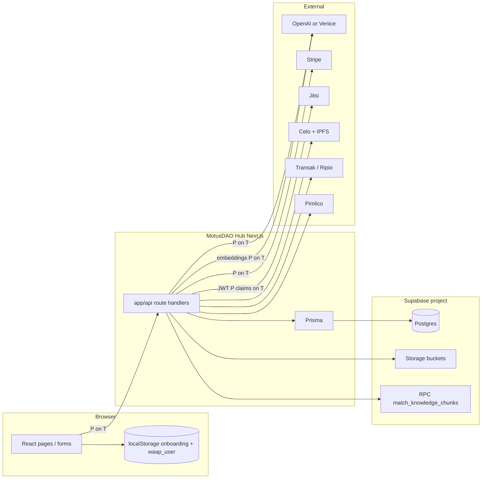
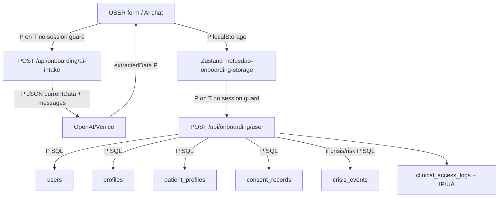
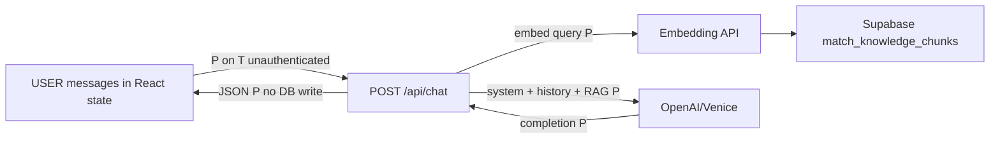
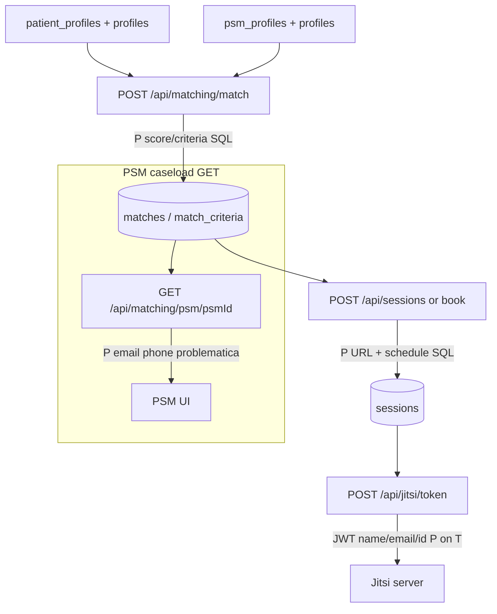
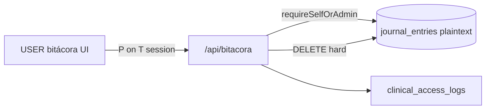
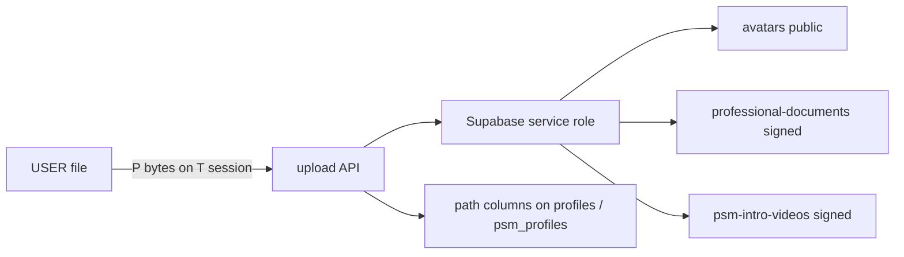
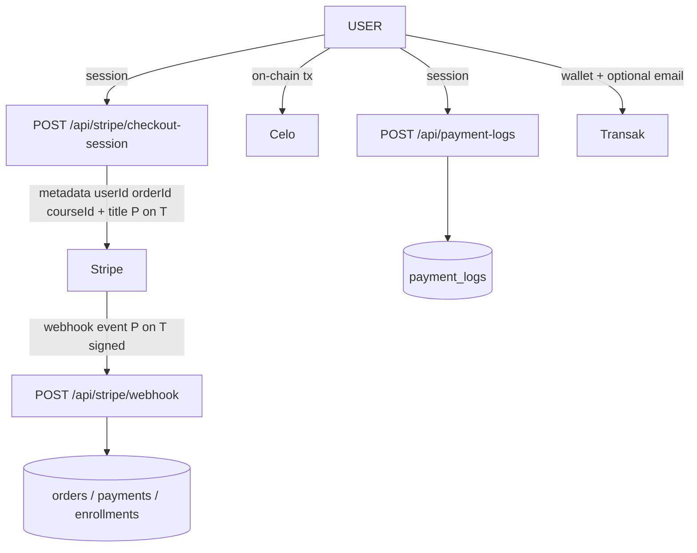
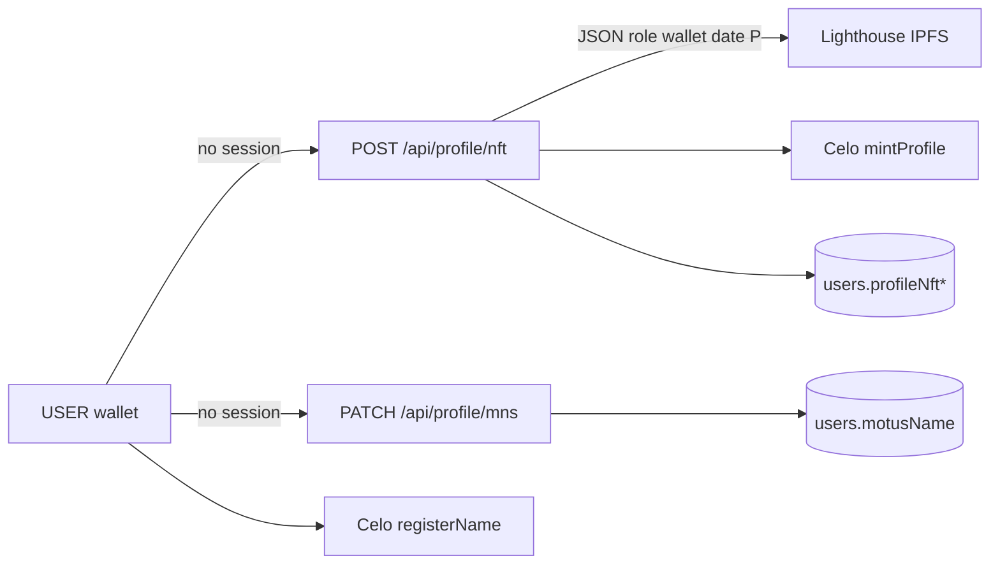
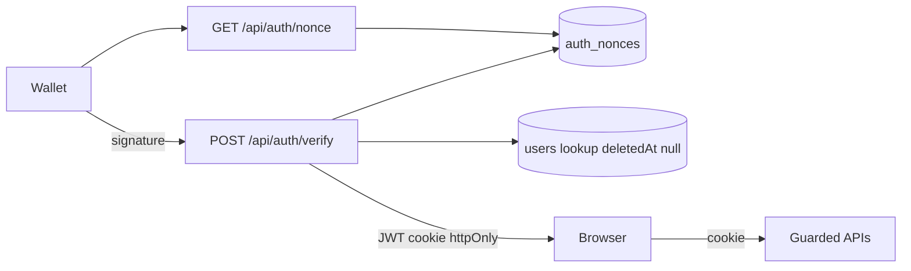

# MotusDAO Hub — Current-State Data Inventory

> **Document type:** Current-state evidence (code audit)  
> **Date of audit:** 2026-08-15  
> **Repository:** `motusdao-hub` (workspace git root)  
> **Primary schema:** `prisma/schema.prisma`  
> **Scope:** What the application currently collects, generates, stores, transmits, exposes, and deletes — as demonstrated by source code.  
> **Out of scope:** Architecture recommendations, technology choices, legal conclusions (including HIPAA/GDPR compliance claims).

**Evidence rule:** Every finding cites `path` + line numbers + function/model/component. Where a behavior is *not* present, the absence is stated as “not found in repository source,” not as a deployed-environment fact.

---

## Legend

### Classification categories

| Code | Category |
|------|----------|
| A | Identity |
| B | Authentication/security |
| C | Contact |
| D | Financial/payment |
| E | Clinical/mental-health |
| F | Therapist-generated clinical data |
| G | Patient-generated clinical data |
| H | AI-derived data |
| I | Operational metadata |
| J | Analytics/telemetry |
| K | Blockchain/wallet data |
| L | Uploaded files |
| M | Communications |
| N | Other |

### Column abbreviations (inventory tables)

| Abbr | Meaning |
|------|---------|
| UG | User-generated |
| CG | Clinician-generated |
| AG | Automatically generated by the application |
| AI | Derived by an AI model |
| HR | Health-related |
| MH | Mental-health-related |
| PI | Potentially identifying |
| S | Sensitive (as used in this inventory: clinical, credential, financial, auth secret, or contact that can locate a person) |
| DI | Can identify a patient **directly** (name, email, phone, government ID, wallet uniquely bound to the person in this system) |
| II | Can identify a patient **indirectly** (quasi-identifiers: city+DOB, clinical narrative uniqueness, IP, user-agent, etc.) |

Boolean cells are `Y` / `N` / `?` (unknown from source).

### Encryption vocabulary (do not collapse these)

| Term | Meaning in this document |
|------|--------------------------|
| **Plaintext** | Application writes or transmits the value without encrypting the payload itself |
| **Transport encryption** | TLS/HTTPS between clients, Hub, and third parties. Repo sets `secure` cookie flag in production (`lib/auth/session.ts:82`); it does not implement TLS. |
| **Database/storage encryption at rest** | Provider-side disk encryption. **Not represented in application source.** |
| **Application-level encryption** | App encrypts field values before insert. **Not found.** |
| **Client-side encryption** | Browser encrypts before send. **Not found.** |
| **End-to-end encryption** | Only endpoints can read. **Not found** for Hub-stored clinical data. Jitsi media path is external; E2EE of video is **not established by this repo**. |
| **MPC / FHE / private computation** | **Not found** for clinical data. WaaP comments describe 2PC for *wallet key* handling (`env.example:18`), not for clinical payloads. |

---

## 1. Executive summary

MotusDAO Hub is a Next.js App Router application. Persistent application data is written through **Prisma** into **PostgreSQL hosted on a Supabase project**. File objects are written through the **Supabase Storage** service-role client. There are **no `"use server"` server actions** in the repository; writes go through `app/api/**` route handlers.

The application currently:

- Collects **identity, contact, wallet, and clinical intake** from patients (`PatientProfile`, `Profile`, `ConsentRecord`) via `POST /api/onboarding/user`.
- Collects **psychologist (PSM) identity, credentials, professional documents, and practice data** via `POST /api/onboarding/psm`.
- Stores **journal/bitácora** free text (`JournalEntry`) via `/api/bitacora`.
- Creates **crisis events** from intake urgency/risk flags (`CrisisEvent`) via `lib/crisis.ts`.
- Matches patients to PSMs and stores **scores and criterion details** (`Match`, `MatchCriterion`).
- Stores **session/appointment metadata and Jitsi URLs** (`Session`), not session transcripts or clinical notes.
- Sends **AI chat and AI intake** payloads (including clinical free text and onboarding `currentData`) to **OpenAI or Venice**. Chat transcripts are **not** written to Postgres by those routes.
- Writes **avatars, professional documents, intro videos, and academy media** to Supabase Storage.
- Records **on-chain Motus Names and a “Motus Clinical Profile” NFT** (wallet, role, registration date — NFT metadata code states it does not include sensitive clinical data).
- Soft-deletes ordinary users (`deletedAt`); **hard-deletes** PSM users (Prisma cascade); **hard-deletes** journal entries. **No user self-delete API** and **no patient data-export API** were found.

**Not found in source:** application-level encryption of stored fields; therapy/session clinical notes models; PHQ/GAD or other standardized assessments; patient–PSM text messaging persistence; product analytics SDKs (PostHog/Sentry/GA); transactional email sending; a retention/purge scheduler.

**Plaintext at rest (application view):** Prisma writes clinical and identity fields as ordinary `String` / `Json` columns. No `encrypt`/`decrypt`/`AES` field handling was found in TypeScript sources (search covered `*.ts`/`*.tsx`; only iframe `encrypted-media` attributes matched).

---

## 2. Application architecture relevant to data

### 2.1 Documented data layer

`docs/architecture/data-layer.md` states one Supabase project holds Postgres (Prisma) and Storage, plus RAG RPC `match_knowledge_chunks`. On-chain Celo is separate (MNS, profile NFTs).

```21:37:docs/architecture/data-layer.md
                    ┌─────────────────────────────────────┐
                    │     Supabase project (one)          │
                    │  ryjkpaiknsnjyydxwugl.supabase.co   │
                    ├─────────────────────────────────────┤
                    │  Postgres                           │
                    │    ↑ Prisma (users, academy, PSM…)  │
                    │    ↑ Supabase RPC (RAG embeddings)  │
                    ├─────────────────────────────────────┤
                    │  Storage buckets                      │
                    │    ↑ lib/storage.ts (media uploads)   │
                    └─────────────────────────────────────┘

        On-chain (Celo) — separate: MNS, profile NFTs via Hardhat/viem
```

Datasource:

```4:8:prisma/schema.prisma
datasource db {
  provider  = "postgresql"
  url       = env("DATABASE_URL")
  directUrl = env("DIRECT_URL")
}
```

### 2.2 Runtime components that handle data

| Component | Role in data handling | Evidence |
|-----------|----------------------|----------|
| Next.js `app/api/**` | All persistence and third-party calls | 89 route files under `app/api/` |
| Prisma client | SQL via `DATABASE_URL` | `lib/prisma.ts:15` |
| Supabase JS admin | Storage uploads + RAG RPC | `lib/supabase-admin.ts`, `lib/motus-knowledge.ts:12-18` |
| OpenAI SDK | Chat completions + embeddings (OpenAI or Venice base URL) | `lib/ai-client.ts:27-36` |
| Stripe SDK | Checkout + webhook fulfillment | `app/api/stripe/**` |
| Jitsi JWT | Video room access tokens | `lib/jitsi-token.ts` |
| Celo / viem | MNS register, NFT mint, payments | `lib/mns-register.ts`, `lib/profile-nft-onchain.ts` |
| Lighthouse SDK | IPFS metadata upload | `lib/profile-nft-metadata.ts:1,50-52` |
| WaaP / optional Privy | Wallet + optional email in browser | `lib/contexts/WaaPProvider.tsx` |
| Zustand persist | Onboarding draft in `localStorage` | `lib/onboarding-store.ts:239-248` |
| `middleware.ts` | **Does not enforce auth**; all `/api` pass through | `middleware.ts:16-18,30-33` |

### 2.3 Access to Postgres from the Data API

Migration `prisma/migrations/20260616130000_revoke_anon_access/migration.sql` revokes `anon`/`authenticated` table rights except `SELECT` on `courses`, `lessons`, `modules`. Application authorization is therefore **not** Supabase RLS-on-Prisma-tables in committed migrations (except a Storage policy for `academy-courses`). Prisma comment on `JournalEntry` claims RLS “requires additional setup” (`prisma/schema.prisma:89`); **no `ENABLE ROW LEVEL SECURITY` SQL for that table was found in committed migrations.**

### 2.4 Client-side stores (leave the server)

| Store | Contents | Evidence |
|-------|----------|----------|
| `localStorage` key `motusdao-onboarding-storage` | Full `OnboardingData` including clinical fields, phone, DOB, consents | `lib/onboarding-store.ts:16-64,239-248` |
| `localStorage` key `waap_user` | WaaP user id, optional email, wallet address | `lib/contexts/WaaPProvider.tsx:415-422` |
| `sessionStorage` `motus:ripio-mock:{wallet}` | Mock KYC name, CLABE | `lib/ripio/ramps-mock-session.ts:10-43` |
| In-memory React state | MotusAI chat messages | `components/ui/animated-ai-chat.tsx` (messages not POSTed to Prisma) |

---

## 3. Complete data inventory

### 3.1 How to read this section

**Source** = where the value originates in the running app. **Destination** = where it is written or sent. **Access** = who the *code* allows. **App encryption** = application-level encryption before storage (all `N` unless noted). **Leaves Hub** = sent to a non-MotusDAO-controlled service as implemented (OpenAI/Venice, Stripe, Transak, Ripio, Lighthouse, Pimlico, Celo public chain, Jitsi server, WaaP/Privy, WalletConnect).

Unless noted, values are stored **plaintext** in Postgres/Storage from the application’s perspective.

---

### A. Identity

| Field | Description | Source | Destination | Model.field | Type | UG | CG | AG | AI | HR | MH | PI | S | DI | II | Access | Auth enforcement | Leaves Hub | External | AI recv | Chain | Retention / deletion | Evidence |
|-------|-------------|--------|-------------|-------------|------|----|----|----|----|----|----|----|---|----|----|--------|-------------------|------------|----------|---------|-------|----------------------|----------|
| `User.id` | Internal user id (cuid) | Prisma default | Postgres | `users.id` | String | N | N | Y | N | N | N | Y | Y | Y | Y | Self, matched PSM (limited), admin | Session JWT `sub`; guards | N (except logs) | — | N | N | Soft-delete keeps row | `schema.prisma:543-544` |
| `User.email` | Account email | Onboarding form / WaaP `requestEmail` | Postgres; Transak optional | `users.email` unique | String | Y | N | N | N | N | N | Y | Y | Y | N | Self, matched PSM, admin; unique lookup | Onboarding POST **unguarded**; later `requireSelfOrAdmin` / profile guards | Y if Transak email sent | Transak `userEmailAddress` | Y if included in AI `currentData` | N | Soft-delete keeps unique email | `schema.prisma:546`; `onboarding/user/route.ts:16,174`; `WaaPProvider.tsx:407-411`; `transak-lite/route.ts:108-109` |
| `Profile.nombre` / `apellido` | Legal/given names | Onboarding / profile API | Postgres; Jitsi display name; public PSM name | `profiles.nombre`, `apellido` | String | Y | Y (PSM) | N | Possible via AI intake extract | N | N | Y | Y | Y | N | Self, matched counterpart, admin; PSM names public | Onboarding unguarded; GET `/api/profile` `assertSessionCanAccessUser` | Y Jitsi JWT `name` | Jitsi | Y in AI intake | N | Cascade on hard user delete; kept on soft-delete | `schema.prisma:345-346`; `jitsi-display-name.ts:13-34`; `psm/public-profile.ts:22-27` |
| `Profile.fechaNacimiento` | Date of birth | Onboarding | Postgres | `profiles.fechaNacimiento` | DateTime | Y | Y | N | Possible extract | Y | N | Y | Y | Y | Y | Self, admin (admin users list) | Onboarding unguarded; admin `guardAdmin` | N unless in AI `currentData` | — | Y if in AI intake | N | Soft-delete keeps | `schema.prisma:348`; `admin/users/route.ts:101` |
| `Profile.ciudad` / `pais` | City / country | Onboarding | Postgres; matching score | `profiles.ciudad`, `pais` | String | Y | Y | N | Possible | N | N | Y | Y | N | Y | Self, matched counterpart, admin; PSM country on public profile | Same | N except public PSM license country | — | Y if in AI intake | N | Soft-delete keeps | `schema.prisma:349-350`; `matching/match/route.ts` (city/country scoring) |
| `Profile.avatarUrl` / `avatarStoragePath` | Avatar | File upload | Supabase `avatars` public URL + Postgres | `profiles.avatarUrl`, `avatarStoragePath` | String? | Y | Y | N | N | N | N | Y | N | N | Y | Public URL if bucket public | Upload via session `resolveUploadActor` | Public URL is fetchable | Supabase Storage | N | N | File not deleted on user soft-delete (not found) | `lib/storage.ts:4,83-107`; `upload-avatar` |
| `User.motusName` | Human-readable on-chain name | Client MNS register | Postgres + Celo MNS | `users.motusName` | String? | Y | N | N | N | N | N | Y | N | N | Y | PATCH `/api/profile/mns` **no session**; public resolution | **No session check** | Y | Celo | N | Y | Kept on soft-delete | `schema.prisma:557`; `profile/mns/route.ts:12-64` |
| `User.role` | `usuario` / `psm` / `admin` | Onboarding / scripts | Postgres; session JWT | `users.role` | enum | N | N | Y | N | N | N | N | Y | N | N | In JWT; admin lists | `requireAdmin` uses JWT role | N | — | N | NFT attribute | Soft-delete keeps | `schema.prisma:545,671-676`; `session.ts:15-19` |

### B. Authentication / security

| Field | Description | Source | Destination | Model.field | Type | UG | AG | S | Access | Auth | App enc | Leaves Hub | Evidence |
|-------|-------------|--------|-------------|-------------|------|----|----|---|--------|------|---------|------------|----------|
| `AuthNonce.address` | Wallet requesting SIWE nonce | Client query | Postgres | `auth_nonces.address` | String | Y | N | Y | Anyone who can hit nonce API | Public GET | N | N | `schema.prisma:532-540`; `auth/nonce/route.ts:14-24` |
| `AuthNonce.nonce` | One-time SIWE nonce | Server random | Postgres then consumed | `auth_nonces.nonce` unique | String | N | Y | Y | Returned to client in JSON | Public GET | N | N | `auth/nonce/route.ts:38-42`; `lib/auth/nonce.ts` |
| `AuthNonce.expiresAt` | 5-minute TTL | Server | Postgres | `auth_nonces.expiresAt` | DateTime | N | Y | N | — | — | N | N | `lib/auth/constants.ts:3` |
| Session cookie `motus_session` | JWT: `sub`, `eoa`, `role`, `authProvider` | `createSessionToken` | HttpOnly cookie | n/a (cookie) | JWT | N | Y | Y | Browser stores; server verifies | HMAC with `AUTH_SECRET` | Signed, not encrypted | N | `lib/auth/session.ts:15-20,73-86`; `constants.ts:1-2` |
| `User.eoaAddress` | Canonical SIWE wallet | Wallet | Postgres unique | `users.eoaAddress` | String | Y | N | Y | Self, matched party, admin | SIWE bind | N | Y chain | `schema.prisma:552` |
| `User.smartWalletAddress` | ZeroDev smart account | Client | Postgres unique | `users.smartWalletAddress` | String? | N | Y | Y | Same | — | N | Y Pimlico/Celo | `schema.prisma:553` |
| `User.authProvider` / `authProviderId` / `privyId` | Wallet vendor identity | Client on verify/onboarding | Postgres | those columns | enum/String | N | Y | Y | Admin list | — | N | Possibly Privy | `schema.prisma:547-549` |
| `AUTH_SECRET` | JWT HMAC key | Env | Process memory | n/a | secret | N | N | Y | Server only | — | — | N | `session.ts:29-35` (dev fallback `'dev-only-insecure-auth-secret'`) |

Nonce rows are deleted on consume and expired cleanup (`lib/auth/nonce.ts`).

### C. Contact

| Field | Description | Source | Dest | Model.field | Type | UG | S | DI | Access | Evidence |
|-------|-------------|--------|------|-------------|------|----|---|----|--------|----------|
| `Profile.telefono` | Phone | Onboarding / profile POST | Postgres | `profiles.telefono` | String | Y | Y | Y | Self, **matched PSM** (active matches), admin | `matching/psm/[psmId]/route.ts:81`; `schema.prisma:347` |
| `ContactMessage.name/email/message` | Contact form | Public form | Postgres | `contact_messages.*` | String | Y | Y | Y | **GET `/api/contact` has no auth** | `app/api/contact/route.ts:27-33,53-86` |
| `ContactMessage.userId` | Optional linker | Client body | Postgres | `contact_messages.userId` | String? | Y | Y | Y | Same unauthenticated GET | `contact/route.ts:32` |

No outbound email send was found (`resend`/`nodemailer`/`sendgrid` not used in `*.ts`/`*.tsx`).

### D. Financial / payment

| Field | Description | Source | Dest | Model | Type | Access | Leaves Hub | Evidence |
|-------|-------------|--------|------|-------|------|--------|------------|----------|
| `Course.priceAmount/currency/billingInterval` | Catalog price | Admin | Postgres | `courses` | Decimal/String/enum | Public catalog | Stripe product_data | `schema.prisma:47-50` |
| `Order.*` | Order header | Checkout / POST `/api/orders` | Postgres | `orders` | mixed | `requireSelfOrAdmin(userId)` | Stripe metadata `orderId,userId,courseId` | `app/api/orders/route.ts:36-73`; `stripe/checkout-session/route.ts` |
| `OrderItem.*` | Line items | Same | Postgres | `order_items` | mixed | Same | Course title/summary to Stripe | `schema.prisma:280-302` |
| `Payment.*` | Payment attempt | Stripe fulfill / on-chain | Postgres | `payments` | mixed | Same | Stripe event objects inbound | `schema.prisma:305-328` |
| `PaymentLog.amount,currency,transactionHash,destinationAddress,notes` | On-chain payment log | Client POST | Postgres | `payment_logs` | String | `requireSelfOrAdmin(fromUserId)` | Hash is public on Celo | `payment-logs/route.ts:22-124` |
| `Enrollment.stripeSubscriptionId` | Stripe sub id | Webhook | Postgres | `enrollments.stripeSubscriptionId` | String? unique | Self/admin | Stripe | `schema.prisma:77` |
| `PaymentPreference.defaultDestination` | Wallet vs PSM vs treasury | User | Postgres | `payment_preferences` | enum | Self | N | `schema.prisma:331-339` |
| Ripio mock `kycName`, `payoutClabe` | Mock KYC | Browser | `sessionStorage` only | n/a | String | Same browser | N (mock) | `ramps-mock-session.ts:3-8` |

`PatientProfile.budgetMin` / `budgetMax` exist on the schema (`schema.prisma:212-213`) and Zustand store (`onboarding-store.ts:51-52`) but **are not in** `userOnboardingSchema` and **are not written** by `POST /api/onboarding/user`. No other writer was found. **Unpopulated unless written by unlisted path.**

### E / F / G. Clinical and mental-health

See §5 for the dense clinical inventory. Summary of models:

| Model | Patient-generated (G) | Therapist-generated (F) | System |
|-------|----------------------|-------------------------|--------|
| `PatientProfile` | Yes (intake) | No | Matching uses it |
| `JournalEntry` | Yes | No | Self/admin only |
| `CrisisEvent` | Derived from patient flags | No | Created at onboarding; **no read API** |
| `ConsentRecord` | Yes (checkboxes) | PSM consents too | Create-only |
| `Match` / `MatchCriterion` | Inputs from patient+PSM profiles | PSM specialties | Algorithm |
| `Session` | Scheduling | Accept/complete/cancel | Jitsi URL |
| `Review.comment` / `issueTags` | Patient about PSM/course | No | Public if published |
| `PSMProfile.adminReviewNotes` | No | Admin (operational, may mention cases) | Admin |

**Therapy notes / session notes / assessments:** not found (no `ClinicalNote`, `SessionNote`, PHQ, GAD models or APIs).

### H. AI-derived data

| Artifact | Stored in DB? | Evidence |
|----------|---------------|----------|
| MotusAI chat completion text | **No** (JSON response only) | `app/api/chat/route.ts:170,179` |
| Supervisor JSON (`apertura`, `reflexion`, …) | **No** | `chat/route.ts:150-170` |
| AI intake `extractedData`, `riskAlert`, `confidence` | **Not by the AI route**; merged into client store; later onboarding POST may persist extracted fields as ordinary patient/PSM columns | `ai-intake/route.ts`; `StepAIIntake.tsx` |
| `User.intakeSource` = `ai_assisted` | Yes | `schema.prisma:556,688-692`; `onboarding/user/route.ts:160` |
| `inferConcernsFromNarrative` | Keyword match, not LLM; may populate `clinicalConcern` | `lib/intake-concerns.ts:39-47,49-70` |
| RAG embeddings of **user query** | Sent to embedding API; not stored as a Hub model | `motus-knowledge.ts:39-51` |
| Knowledge chunk embeddings | Supabase pgvector (not a Prisma model) | `motus-knowledge.ts:47-51`; `data-layer.md:125-127` |

### I. Operational metadata

Timestamps (`createdAt`/`updatedAt`), `onboardingStatus`, `registrationCompleted`, `verificationStatus`, `Session.status`, `Match.status`, `ClinicalAccessLog.*`, `Enrollment.progress`, `LessonProgress.*`, course catalog fields, availability slots.

`ClinicalAccessLog` stores `ipAddress` (from `x-forwarded-for` / `x-real-ip`) and `userAgent` (`lib/clinical-audit.ts:28-32`). Category **J** as well as **I**.

### J. Analytics / telemetry

| Mechanism | What is recorded | Evidence |
|-----------|------------------|----------|
| Product analytics SDK | **Not found** (no PostHog/Sentry/gtag/mixpanel in app source) | Grep `*.ts,*.tsx` |
| `console.log` / `console.error` | Wallet addresses, NFT mint, Transak env presence, Prisma masked URL, clinical-audit failures | e.g. `profile/nft/route.ts:27-42`; `prisma.ts:24-25` |
| Prisma `log: ['query']` in development | SQL queries (may include bound clinical values depending on Prisma logging) | `lib/prisma.ts:8-11` |
| `ClinicalAccessLog` | Access events + IP + UA | `lib/clinical-audit.ts` |
| Vercel/host logs | **Not in repo** | Runtime unknown |

### K. Blockchain / wallet

See §8. Fields: `eoaAddress`, `smartWalletAddress`, `motusName`, `mnsTxHash`, `mnsRegisteredAt`, `profileNftTxHash`, `profileNftTokenURI`, `PaymentLog.transactionHash`, `Payment.destinationAddress`.

### L. Uploaded files

See §9. Buckets: `avatars`, `professional-documents`, `psm-intro-videos`, `academy-lessons`, `academy-courses`.

### M. Communications

| Channel | Persisted in Hub? | Evidence |
|---------|-------------------|----------|
| MotusAI chat | No | `chat/route.ts` |
| AI intake chat | No (client store) | `onboarding-store.ts` persist |
| Patient–PSM text messages | **No model** | Schema has no Message/Chat |
| Contact form | Yes `ContactMessage` | `contact/route.ts` |
| Jitsi A/V | Not in Hub DB; URL in `Session.externalUrl` | `schema.prisma:462-463` |
| Email notifications | **Not sent by Hub code** | No mailer |

### N. Other

Academy content (`Course`, `Module`, `Lesson.contentMDX`), FX rates (`/api/fx/usd-mxn`), faucet logs (no dedicated model), debug wallet analysis (`/api/debug/wallets`, blocked in production).

---

## 4. Database model inventory

All models from `prisma/schema.prisma`. Mapped table names via `@@map` where present.

| Model | Table | Purpose | Contains clinical? | Contains identifiers? | Cascade from User |
|-------|-------|---------|--------------------|----------------------|-------------------|
| `User` | `users` | Account, wallets, onboarding flags, MNS/NFT refs, soft-delete | Indirect (`intakeSource`) | Email, wallets, motusName | Root |
| `Profile` | `profiles` | Civil identity | DOB | Name, phone, city, country, avatar | `onDelete: Cascade` `:357` |
| `PatientProfile` | `patient_profiles` | Therapy/platform intake | **Yes** | Linked via `userId` | Cascade `:221` |
| `PSMProfile` | `psm_profiles` | Psychologist public + credential data | Practice clinical scope (exclusions, complexity) | Cedula, documents, name via Profile | Cascade `:411` |
| `ConsentRecord` | `consent_records` | Consent flags | Consent-to-share/matching/AI | `userId` | Cascade `:433` |
| `CrisisEvent` | `crisis_events` | Crisis flag from intake | **Yes** (summary = problematica, riskFlags) | `userId` | Cascade `:450` |
| `JournalEntry` | `journal_entries` | Bitácora | **Yes** (free text, mood, tags) | `userId` | Cascade `:98` |
| `ClinicalAccessLog` | `clinical_access_logs` | Access audit | Resource ids; metadata may include concerns | actor/target user ids, IP, UA | Relations optional (no cascade in model) `:115-116` |
| `Match` | `matches` | Patient–PSM pairing | Score breakdown uses clinical criteria | Both user ids | Cascade `:176-177` |
| `MatchCriterion` | `match_criteria` | Per-criterion scores | Criterion names/details | Via match | Cascade `:193` |
| `Session` | `sessions` | Appointment + Jitsi URL | Scheduling; not notes | Patient + PSM ids | Cascade `:480-481` |
| `ProviderAvailabilitySlot` | `provider_availability_slots` | PSM calendar | Notes field (free text) | `psmId` | Cascade `:501` |
| `Review` | `reviews` | Ratings | `comment`, `issueTags` may be clinical | `authorId`; anonymous flag | Cascade author `:521` |
| `AuthNonce` | `auth_nonces` | SIWE nonce | No | Wallet address | No user FK |
| `ContactMessage` | `contact_messages` | Contact form | Possible in `message` | name, email | Optional user |
| `Course` / `Module` / `Lesson` | `courses` / `modules` / `lessons` | Academy catalog | Educational MH content possible in MDX | Instructor strings | n/a |
| `Enrollment` | `enrollments` | Course access | No | `userId` | Cascade `:84` |
| `LessonProgress` | `lesson_progress` | Lesson completion | No | `userId` | Cascade `:155` |
| `Order` / `OrderItem` / `Payment` / `PaymentLog` / `PaymentPreference` | mapped names | Commerce | `notes` free text | user ids, wallet dest | Cascade from user where FK |

Enums of clinical relevance: `UrgencyLevel` (`low|medium|high|crisis`), `ClinicalResource`, `CrisisSeverity`, `CrisisStatus`, `IntakeSource` (`manual|ai_assisted|hybrid`), `Modality`, `VerificationStatus`.

**Not in Prisma (accessed otherwise):**

| Store | Access | Evidence |
|-------|--------|----------|
| Knowledge chunks + embeddings | `supabase.rpc('match_knowledge_chunks')` with service role | `lib/motus-knowledge.ts:47-51` |
| Storage objects | `supabase.storage.from(bucket)` | `lib/storage.ts` |
| Stripe objects | Stripe API | `app/api/stripe/**` |

---

## 5. Sensitive / clinical data inventory

### 5.1 `PatientProfile` (`patient_profiles`)

Written by `POST /api/onboarding/user` (`app/api/onboarding/user/route.ts:214-262`). Read by GET `/api/profile` (full object, `profile/route.ts:190-191`), admin users list (subset), matching (internal scoring), PSM caseload (`problematica`, `tipoAtencion` only in JSON).

| Field | Description | Cat | UG | AI | MH | S | DI | II | Who can read (code) | Encrypted before store | Leaves Hub | Deletion |
|-------|-------------|-----|----|----|----|---|----|----|---------------------|------------------------|------------|----------|
| `tipoAtencion` | Attention type / primary concern slug or `'plataforma'` | E/G | Y | Keyword infer possible | Y | Y | N | Y | Self, admin; PSM sees on active match | N (plaintext) | AI intake if in `currentData` | Soft-delete keeps; cascade on hard delete |
| `problematica` | Free-text reason for consultation (therapy min 10 chars) | E/G | Y | Extract | Y | Y | N | Y | Self, admin, **matched PSM** | N | AI (intake + possibly chat if user pastes) | Same |
| `preferenciaAsignacion` | `automatica` / `explorar` | I | Y | Extract | N | N | N | N | Self, admin | N | AI intake | Same |
| `clinicalConcern` | JSON array of concern slugs (ansiedad, depresion, trauma, …) | E/G/H | Y | Keyword + AI extract | Y | Y | N | Y | Self, admin; used in matching; audit metadata | N | AI intake | Same |
| `urgencyLevel` | `low\|medium\|high\|crisis` | E/G | Y | AI may set crisis | Y | Y | N | Y | Self, admin; blocks auto-match if crisis | N | AI intake | Same |
| `preferredModality` | Forced `'video'` on write | I | N | N | N | N | N | N | Self | N | N | Same |
| `preferredTherapyStyle` | JSON styles | E/G | Y | Extract | Y | N | N | N | Self, admin | N | AI | Same |
| `languages` | JSON | I | Y | Extract | N | N | N | N | Self, matching | N | AI | Same |
| `timezone` | String | I | Y | Extract | N | N | N | Y | Self | N | AI | Same |
| `availability` | JSON notes / platform use cases | E/I | Y | Extract | Possible | Possible | N | Y | Self | N | AI | Same |
| `paymentPreference` | String | D | Y | N | N | N | N | N | Self | N | N | Same |
| `therapistGenderPreference` | String | I | Y | N | N | N | N | N | Self | N | N | Same |
| `priorTherapyExperience` | Boolean | E/G | Y | N | Y | Y | N | N | Self, admin | N | AI if in currentData | Same |
| `medicationOrDiagnosisContext` | Free-text meds/diagnoses | E/G | Y | Extract | Y | Y | N | Y | Self, admin (**not** in PSM match JSON) | N | **Yes if AI intake** | Same |
| `riskFlags` | JSON: `none`, `self_harm`, `violence`, `abuse`, `substance_use` | E/G | Y | Extract | Y | Y | N | Y | Self, admin; triggers `CrisisEvent` | N | AI intake | Same |
| `budgetMin`/`budgetMax` | Schema only | D | ? | N | N | N | N | N | If populated: same as row | N | N | Same |

Concern option list: `lib/intake-concerns.ts:1-14`. Risk flags UI: `StepPerfilUsuario.tsx:92-98`. Crisis trigger: `lib/crisis.ts:12-14`.

**Authorization notes:**

- Onboarding POST: **no `requireSession`** (`onboarding/user/route.ts:94-97`).
- Profile GET returns full `patientProfile` after `assertSessionCanAccessUser` (`profile/route.ts:158,190`).
- Matched PSM GET does **not** return `medicationOrDiagnosisContext` or `riskFlags`; it does return `problematica` and `tipoAtencion` plus phone and email (`matching/psm/[psmId]/route.ts:76-88`). Guard: `requireSelfOrAdmin(psmId)` (`:18`).
- Admin GET `/api/admin/users` returns `tipoAtencion`, `problematica`, `preferenciaAsignacion` (`admin/users/route.ts:108-112`) behind `guardAdmin`.

### 5.2 `JournalEntry` (`journal_entries`)

| Field | Cat | UG | MH | S | Access | External | Deletion |
|-------|-----|----|----|---|--------|----------|----------|
| `content` | G/E/M | Y | Y | Y | Owner or admin (`requireSelfOrAdmin` / `requireJournalOwnerOrAdmin`) | N unless user pastes into `/api/chat` | Hard delete `DELETE /api/bitacora` `:196` |
| `mood` | G/E | Y | Y | Y | Same | N | Same |
| `tags` | G/I | Y | Possible | Possible | Same | N | Same |

**PSM cannot read journal via this API.** Audit: `recordClinicalAccess` on create/list/update/delete (`bitacora/route.ts`).

Prisma comment at `schema.prisma:89` mentions RLS; committed migrations do not enable it. App access control is JWT guards, not Postgres RLS in repo SQL.

### 5.3 `CrisisEvent`

Created only from user onboarding (non-platform) when `urgencyLevel === 'crisis'` or risk flags include `self_harm`/`violence`/`abuse` (`lib/crisis.ts:12-28`; call `onboarding/user/route.ts:287-298`).

| Field | Content | MH | S |
|-------|---------|----|---|
| `summary` | `patientProblematica` (intake narrative) | Y | Y |
| `metadata` | `{ riskFlags, clinicalConcern, preferredModality }` | Y | Y |
| `severity` | `high` if crisis else `possible` | Y | Y |
| `status` | default `open` | I | N |

**No HTTP read/update/resolve route found.** Enum includes `crisis_event` for audit (`schema.prisma:618`) but `createCrisisEventIfNeeded` does **not** call `recordClinicalAccess`.

### 5.4 `ConsentRecord`

Created on user and PSM onboarding. **No revoke/update API found.**

| Field | User onboarding | PSM onboarding |
|-------|-----------------|----------------|
| `consentToTerms/Privacy/AI/ShareWithPSM/ClinicalMatching` | Written (`user/route.ts:265-280`) | Written (`psm/route.ts:326-335`) |
| `policyVersion`, `locale`, `scope` | Set on user create | **Not set** on PSM create (schema defaults) |
| `revokedAt`, `revocationReason` | Schema only; no writer found | Same |

Platform track forces share/matching consents **false** in the client payload (`components/onboarding/steps/StepRevision.tsx:162-163`). Schema defaults on API are `true` for share/matching (`user/route.ts:60-61`) if the client omits them.

### 5.5 PSM clinical-adjacent fields

Public marketplace (`lib/psm/public-profile.ts`) exposes: name, masked cedula last 4 (`maskCedula` `:75-78`), formation, specialties, therapy styles, languages, **exclusion criteria labels**, `doesNotWorkWithNote`, intro video signed URL, price, reputation. **No auth** on GET `/api/psm`, `/api/psm/[slug]`.

Non-public: `cedulaProfesional` full, `cedulaDocumentPath`, `tituloDocumentPath`, `adminReviewNotes`, `availability` JSON (includes `excludedCases`, `clinicalComplexityLevels`, `emergencyProtocolStatus`, `legalDeclarations`).

Documents: signed URL 3600s (`lib/storage.ts` professional documents; `document-url/route.ts:73-88`). Access: owner EOA, SIWE-only during onboarding, or admin.

### 5.6 Matching stored clinical derivatives

`Match.score`, `Match.scoreBreakdown`, `MatchCriterion.criterion/score/details` store **why** a pair scored (concern overlap, language, city, etc.) (`app/api/matching/match/route.ts`). These are **derived**, not a second copy of `problematica`, but they encode clinical concern matching.

Automatic match refused if `urgencyLevel === 'crisis'` (`matching/match/route.ts:82-87`).

### 5.7 What is *not* collected (evidence of absence)

| Expected clinical artifact | Result |
|----------------------------|--------|
| Therapy/progress notes | No model/API |
| Session recordings metadata in Hub | JWT *allows* Jitsi recording feature for moderators (`jitsi-token.ts:37-40`); Hub does not store recordings |
| Standardized assessments (PHQ, GAD, etc.) | Not found |
| Patient–PSM chat history | Not found |
| Prescriptions | Not found |
| Insurance / national health IDs | Not found (cedula profesional is **provider** license, not patient NSS) |
| User data export (portable copy) | Not found |
| User self-service account deletion | Not found |

---

## 6. External data flows

Exact payloads as implemented (not inferred from package names).

| Service | Direction | What Hub sends | Auth of Hub route | Evidence |
|---------|-----------|----------------|-------------------|----------|
| **OpenAI** | Out | Chat messages + system prompt; embeddings of user query | `/api/chat` and `/api/onboarding/ai-intake` **have no session guard** | `ai-client.ts:35`; `chat/route.ts:90-148`; `ai-intake/route.ts:237-258` |
| **Venice AI** | Out | Same, via `baseURL` `https://api.venice.ai/api/v1` | Same | `ai-client.ts:28-32` |
| **Stripe** | Out | Checkout: `client_reference_id` order id; metadata `orderId`, `userId`, `courseId`; product name = course title; description = course summary truncated 500 | `requireSelfOrAdmin` | `stripe/checkout-session/route.ts` (metadata + line_items) |
| **Stripe** | In | Full webhook event after signature check | `STRIPE_WEBHOOK_SECRET` | `stripe/webhook/route.ts:15-37` |
| **Transak** | Out | Auth session with API key; widget params: `walletAddress`, network `celo`, `CUSD`, optional `userEmailAddress` | No session guard on route | `transak-lite/route.ts:43-110` |
| **Ripio** | Out | Form login `username: "{clientId}:{externalRef}:{address}"`, password = client secret | Widget-token route | `ripio/widget-token/route.ts`; `ramps-widget.ts` |
| **Pimlico** | Out | JSON-RPC UserOperation (`sender`, `callData`, gas, `signature`, paymaster fields) | Proxy routes; API key server-side | `app/api/pimlico/paymaster/route.ts`, `bundler/route.ts` |
| **Jitsi** | Out | JWT: `room`, `context.user.id`, `name` (resolved from profile), `email` (from client body or `''`), moderator/recording flags | `/api/jitsi/token` requires session; guest-token is public for open rooms | `jitsi-token.ts:21-45`; `jitsi/token/route.ts:17-57` |
| **Lighthouse / IPFS** | Out | JSON metadata: name, description, attributes role/wallet/registration_date | `/api/profile/nft` **no session** | `profile-nft-metadata.ts:28-52` |
| **Celo public RPC** | Out | Signed txs (MNS, NFT mint, payments, faucet) | Various | `profile-nft-onchain.ts`; `mns-register.ts`; `faucet/route.ts` |
| **WaaP (Human.tech)** | Browser | Accounts, optional email via `requestEmail()` | Client SDK | `WaaPProvider.tsx:387-422` |
| **Privy** | Browser | When `NEXT_PUBLIC_WALLET_PROVIDER=privy` | Client | `env.example:5-9` |
| **WalletConnect** | Browser | Optional project id | Client | `WaaPProvider.tsx:228` |
| **ZeroDev** | Browser + bundler | Smart account creation; EOA addresses logged in client | Client | `ZeroDevSmartWalletProvider.tsx` |
| **Mt Pelerin** | Browser | Widget URL + `walletAddress` query | Client page | `app/pagos/page.tsx` |
| **Supabase** | Out | All SQL (via Prisma) and storage bytes (service role) | Server env | `data-layer.md`; `supabase-admin.ts` |
| **Hardcoded fallback** | Client module | Default project URL + **anon JWT baked into source** if env missing | n/a | `lib/supabase.ts:4-5` |

**Not found:** Hub sending journal content to AI automatically; Hub sending `PatientProfile` to Stripe; Hub sending clinical fields on-chain in NFT metadata (code explicitly omits them).

---

## 7. AI data flows

### 7.1 MotusAI chat — `POST /api/chat`

**Auth:** none (`app/api/chat/route.ts:90-97`).

**Key gate:** `hasAIKey()`; missing key → 401 (`:91-93`).

**Messages sent to provider** (`:109-148`):

1. System: full `SYSTEM_PROMPT` (`:7-38`) — includes few-shot **clinical vignettes** (celos, vacío, etc.).
2. Optional assistant message: RAG snippets `Contexto verificado…` (`:137-141`).
3. **Entire client `messages` array as-is** (`:146-148`), including any user-typed case material.

**RAG:** if enabled and not supervisor mode, last user text is embedded and searched (`:120-135`; `motus-knowledge.ts:39-51,81-85`) against namespaces `clinical-policy`, `product`, and unfiltered. User query text **leaves Hub** to the embedding API.

**Response:** JSON `{ mode, text|sections, ragSources }`. **No Prisma write.**

**Supervisor mode:** same stack + JSON schema (`:150-155`). Prompt instructs “no clinical advice” but still processes case text.

### 7.2 Onboarding AI intake — `POST /api/onboarding/ai-intake`

**Auth:** none.

**Body:** `role`, `messages`, `currentData` (arbitrary record), `phase`, `questionIndex` (`:13-19`).

**Second system message includes** `JSON.stringify(body.currentData || {})` (`:251`) — can contain `nombre`, `apellido`, `telefono`, `fechaNacimiento`, `problematica`, `medicationOrDiagnosisContext`, `riskFlags`, PSM cedula, etc.

**User utterances** appended (`:254-258`).

**Output schema** includes `extractedData`, `riskAlert` `none|crisis_possible` (`:43-46`). Does **not** insert `CrisisEvent`.

**Persistence:** client merges into Zustand (`motusdao-onboarding-storage`). Final clinical persistence is the later onboarding POST.

System prompt tells the model to mention VeniceAI (`:95`) regardless of actual `AI_PROVIDER`.

### 7.3 Prompt locations

No standalone prompt files. Prompts are inline:

- `app/api/chat/route.ts:7-38`
- `app/api/onboarding/ai-intake/route.ts:80-105`

### 7.4 Plaintext transitions (AI)

```
USER typed text (plaintext in browser)
  → HTTPS to Hub API (transport encryption if HTTPS)
  → Hub process memory (plaintext)
  → OpenAI/Venice HTTPS JSON (plaintext payload on TLS)
  → Model provider (retention = provider policy; not in this repo)
  → JSON response to Hub
  → JSON to browser
  → Chat: not stored by Hub
  → Intake: may be stored in localStorage then Postgres (plaintext)
```

---

## 8. Blockchain data flows

### 8.1 Motus Name Service (MNS)

- Contract address in `lib/motus-name-service.ts`.
- On-chain: `registerName(name, targetAddress)` from user wallet.
- Off-chain: `users.motusName`, `mnsTxHash`, `mnsRegisteredAt` via `PATCH /api/profile/mns` (**no session authentication**; body `eoaAddress` trusted) (`profile/mns/route.ts:6-29,52-58`).

**On-chain content:** name string + target address. **Not** clinical narrative.

### 8.2 Profile NFT (“Motus Clinical Profile”)

Metadata built in `uploadProfileMetadataToIPFS` (`lib/profile-nft-metadata.ts:28-46`):

- `name`: `"Motus Clinical Profile - {wallet slice}"`
- `description`: states it certifies basic financial registration and **does not contain sensitive clinical data**
- `attributes`: `role`, `wallet`, `registration_date`

Uploaded with Lighthouse `uploadBuffer` → `ipfs://{Hash}` (`:50-59`). Mint: `mintProfile(wallet, tokenURI)` (`profile-nft-onchain.ts`). Postgres: `profileNftTxHash`, `profileNftTokenURI` (`profile/nft/route.ts:44-49`).

**Route auth:** `POST /api/profile/nft` accepts `{ wallet, role, registrationDate }` with **no session check** (`:8-22`).

IPFS content is **public once pinned**. Wallet + role + date are identifying/quasi-identifying, not intake text.

### 8.3 Payments / faucet

On-chain payment logs store `transactionHash`, `destinationAddress`, amounts (`PaymentLog`). Faucet sends CELO using `CELO_FAUCET_PRIVATE_KEY` (`app/api/faucet/route.ts`).

### 8.4 What blockchain does *not* receive (from this code)

`problematica`, journal `content`, `medicationOrDiagnosisContext`, `riskFlags`, phone, email, DOB, document files.

---

## 9. File / storage flows

Buckets (`lib/storage.ts:4-10`):

| Bucket | Path | Public vs signed | Contents | Max / MIME |
|--------|------|------------------|----------|------------|
| `avatars` | `{eoa}/avatar.{ext}` | **Public URL** `:63-67,106` | Profile photos | 5MB jpeg/png/webp/gif |
| `professional-documents` | `{eoa}/cedula\|titulo.{ext}` | **Signed 3600s** | License / degree | 10MB + PDF |
| `psm-intro-videos` | `{eoa}/intro-video.{ext}` | **Signed 7200s** | Intro video | 100MB mp4/webm |
| `academy-lessons` | `{courseId}/{lessonId}/…` | **Signed 3600s** | Lesson video/PDF | 100MB / 10MB |
| `academy-courses` | `{courseId}/cover.{ext}` etc. | **Public** + storage policy | Covers, lesson images | 5–10MB |

Uploads use **service role** (`getSupabaseAdmin()`), not the end-user JWT. Path ownership is `ownerKey` = checksummed lowercase EOA (`:37-42,89-91`).

Academy covers public read policy: `prisma/migrations/20260628230000_academy_course_covers_bucket/migration.sql:24-27`.

**Application-level encryption of file bytes:** not found. Files uploaded as received buffers (`storage.ts:92-99`).

**Deletion of storage objects on user soft-delete:** not found in `admin/users/[userId]` (only `deletedAt`). Academy media delete exists on admin lesson/course routes.

---

## 10. Authentication and authorization model

### 10.1 Login

1. `GET /api/auth/nonce?address=` → SIWE message (Celo 42220, 5 min nonce) (`auth/nonce/route.ts`, `constants.ts:1-5`).
2. Client `signSiweMessage` (`lib/auth/client.ts:53-95`).
3. `POST /api/auth/verify` → recover address, consume nonce, load user `deletedAt: null`, set cookie (`auth/verify/route.ts`).
4. Cookie: `motus_session`, httpOnly, `sameSite: 'lax'`, `secure` in production, 7 days (`session.ts:79-86`).

**Session read does not re-query the database** (`getSessionFromRequest` JWT-only, `session.ts:89-104`). Soft-delete or role change is not reflected until cookie expiry or re-verify.

### 10.2 Guards (`lib/auth/guards.ts`, `session.ts`)

| Guard | Rule |
|-------|------|
| `requireSession` | Cookie JWT valid + `eoa` present |
| `requireAdmin` | Dev bypass **or** `role === 'admin'` and `userId` |
| `requireSelfOrAdmin` | Actor userId equals target or admin |
| `assertSessionCanAccessUser` | Admin, userId match, or EOA match |
| `requireMatchParticipantOrAdmin` | Patient, PSM, or admin on that match |
| `requireJournalOwnerOrAdmin` | Entry owner or admin |
| `requireMatchedUserAccess` | Self, admin, or **active matched PSM** for that patient id |
| `guardAdmin` | JSON 401/403 wrapper |
| `resolveUploadActor` | Session user/EOA must match upload target (`storage-auth.ts`) |

**Middleware does not apply these guards** (`middleware.ts:16-18`).

### 10.3 Routes observed **without** session guards

| Route | Data risk (factual) | Evidence |
|-------|---------------------|----------|
| `POST /api/onboarding/user` | Writes identity + clinical intake | `onboarding/user/route.ts:94` |
| `POST /api/onboarding/psm` | Writes PSM identity + credentials | Clinical audit of `onboarding/psm/route.ts` |
| `POST /api/onboarding/ai-intake` | Sends PII/clinical to AI | `ai-intake/route.ts` |
| `POST /api/chat` | Sends messages to AI | `chat/route.ts:90` |
| `GET /api/contact` | Lists all contact messages + user email/role | `contact/route.ts:53-86` |
| `POST /api/contact` | Public write | `:3` |
| `PATCH /api/profile/mns` | Updates motusName by `eoaAddress` body | `profile/mns/route.ts:12-29` |
| `POST /api/profile/nft` | Mints NFT + updates user by wallet | `profile/nft/route.ts:8-22` |
| `GET /api/psm`, `GET /api/psm/[slug]` | Public professional profiles | `psm/public-profile.ts` |
| `GET /api/health/db` | Connectivity; error messages may include DB errors | `health/db/route.ts` |
| `GET /api/jitsi/guest-token` | Guest JWT for open rooms | guest-token route |

### 10.4 Admin

- Role stored on `User.role`; grant via scripts (e.g. `scripts/grant-admin.ts`), not a self-service API found.
- Admin user list includes phone, DOB, `problematica` (`admin/users/route.ts:97-112`).
- Dev bypass: `NODE_ENV===development` && `DEV_BYPASS_ADMIN_AUTH=1` (`lib/auth/dev-bypass.ts:11-16`).

### 10.5 Jitsi authorization

`authorizeJitsiRoomAccess` (`lib/jitsi-policies.ts`) gates room prefixes. Display name from `nombre`+`apellido`, else motus name, else email local-part (`jitsi-display-name.ts:13-48`). Client may also pass `userEmail` into JWT (`jitsi/token/route.ts:20-55`).

---

## 11. Encryption currently used

| Layer | Present in code? | Detail |
|-------|------------------|--------|
| 1. Plaintext application data | **Yes** | Prisma String/Json fields; Storage raw bytes; AI JSON bodies |
| 2. Transport encryption | **Relied upon, not implemented in-app** | Production cookie `secure: true` (`session.ts:82`). Origin uses `x-forwarded-proto` (`:46-48`). |
| 3. DB/storage encryption at rest | **Not represented** | Would be Supabase/cloud default if enabled — runtime verification |
| 4. Application-level field encryption | **Not found** | Grep no AES/cipher/encrypt of fields |
| 5. Client-side encryption | **Not found** | Onboarding persist is JSON in localStorage |
| 6. End-to-end encryption | **Not found** for Hub data | Jitsi media E2EE not established here |
| 7. MPC/FHE over clinical data | **Not found** | WaaP 2PC is wallet-key commentary (`env.example:18`) |

**Signing (not encryption):** Hub session JWT (`jsonwebtoken.sign`, `session.ts:73-76`); Jitsi JWT HS256 (`jitsi-token.ts:45`); Stripe webhook signature verify (`stripe/webhook/route.ts:32`).

**Secrets in source:** `lib/supabase.ts:4-5` embeds a fallback Supabase URL and anon JWT. `AUTH_SECRET` missing from `env.example` (used in `session.ts:30-34`).

---

## 12. Retention / deletion currently implemented

| Mechanism | Behavior | Evidence |
|-----------|----------|----------|
| User soft-delete | `deletedAt = now()`; related clinical rows **unchanged** | `admin/users/[userId]/route.ts:53-59` |
| User restore | `deletedAt null`, `restoredAt now()` | Same file PATCH |
| Admin users cannot be soft-deleted | 403 | `:45-50` |
| PSM hard-delete | `prisma.user.delete` — comment lists cascade of profile, matches, sessions, payments | `admin/psm/[psmId]/route.ts:117-125` |
| Journal hard-delete | Owner/admin | `bitacora/route.ts:196` |
| Match hard-delete | Admin; deletes sessions then match | `matching/[matchId]/route.ts` |
| Auth nonce | Deleted on use / expiry cleanup | `lib/auth/nonce.ts` |
| Consent revoke | Fields exist; **no API writer found** | `schema.prisma:429-430` |
| Retention scheduler / TTL on clinical tables | **Not found** | Grep |
| User self-delete | **Not found** | — |
| Data export | **Not found** (academy JSON export is catalog, not patients) | `scripts/export-academy-courses.ts:28-31` |
| Storage files on user delete | **Not found** | Soft-delete handler |
| Academy backups | JSON under `prisma/data/backups/` (git-allowed) | `.gitignore:64-67`; export script |
| Postgres backups | **Not in application source** | Infra/Supabase dashboard |

Filter `deletedAt: null` appears on login and many reads; **existing JWT still authenticates until expiry** (no live `deletedAt` check in `getSessionFromRequest`).

---

## 13. Data-flow diagrams

Legend: **P** = plaintext at that hop (application payload). **T** = TLS if the deployment uses HTTPS (not implemented in app code).

### 13.1 System context



### 13.2 Patient onboarding (therapy track)



### 13.3 MotusAI chat



### 13.4 Matching, session, video



### 13.5 Journal



### 13.6 Files



### 13.7 Payments



### 13.8 NFT / MNS



### 13.9 Authentication



---

## 14. High-risk findings

These are **observations of implemented behavior**, not legal determinations and not redesign proposals.

1. **Clinical intake is stored in plaintext columns** (`patient_profiles.problematica`, `medicationOrDiagnosisContext`, `riskFlags`, `journal_entries.content`) with no application-level encryption (`prisma/schema.prisma:199-218,90-97`; encrypt search negative).

2. **AI providers receive identifying and clinical payloads** including `currentData` JSON and free-text messages (`ai-intake/route.ts:251-258`; `chat/route.ts:146-148`). Those two routes are **unauthenticated**.

3. **Onboarding writes (patient and PSM) are unauthenticated** at the route level (`onboarding/user/route.ts:94`). Anyone who can POST a valid body can create/update rows keyed by email/EOA identity resolution.

4. **Matched PSMs receive patient email, phone, and `problematica`** (`matching/psm/[psmId]/route.ts:76-88`). Journal and medication fields are not in that payload; `problematica` is.

5. **`GET /api/contact` lists messages without authentication** (`contact/route.ts:53-86`), including `name`, `email`, `message`, and linked `user.email`.

6. **NFT and MNS profile update routes lack session checks** (`profile/nft/route.ts:8-22`; `profile/mns/route.ts:12-29`).

7. **Onboarding drafts (including clinical text, phone, DOB) persist in browser `localStorage`** (`onboarding-store.ts:239-248`).

8. **Avatars are public URLs** (`lib/storage.ts:63-67`). Intro videos and credentials use signed URLs.

9. **Soft-delete does not remove clinical rows or storage objects**; unique email/wallet remain on the row (`admin/users/[userId]/route.ts:53-59`). JWT is not invalidated by `deletedAt`.

10. **PSM hard-delete cascades related DB rows** including matches/sessions (`admin/psm/[psmId]/route.ts:117-125`) — irreversible in this handler.

11. **Audit log stores IP and User-Agent** (`clinical-audit.ts:28-32`) and can fail open (`console.warn` only, `:35-37`). No product API to review logs (only smoke script).

12. **Anon JWT fallback is committed** (`lib/supabase.ts:4-5`).

13. **Crisis events have no application read/resolve path**; AI `riskAlert` does not create them.

14. **Admin directory returns `problematica` and phone/DOB** for listed users (`admin/users/route.ts:97-112`).

15. **Prisma development query logging is enabled** (`lib/prisma.ts:8-11`), which can print SQL involving clinical values in dev logs.

---

## 15. Unknowns requiring human verification

See also § “Requires runtime verification” below.

- Whether production `DATABASE_URL` points at the Supabase project named in `data-layer.md`.
- Whether Supabase disk encryption, PITR, and backup schedules are enabled.
- Whether Storage buckets besides `academy-courses` are public or have RLS in the live project (repo has one public-read policy migration).
- Whether `JournalEntry` RLS exists in the live database despite missing migration SQL.
- OpenAI / Venice data-retention, training, and zero-retention contract settings.
- Whether production `AI_PROVIDER` is `openai` or `venice`.
- Jitsi server recording, logging, and whether rooms are actually E2EE.
- WaaP/Privy/WalletConnect what those vendors retain (email, IP).
- Stripe customer objects (email) beyond Hub metadata.
- Whether Vercel logs capture request bodies.
- Whether `AUTH_SECRET` is set in production (code throws if missing in production).
- Whether the hardcoded Supabase anon key in `lib/supabase.ts` is still valid and which tables it can hit given the revoke migration.
- Live `deletedAt` vs unique constraint behavior if a new user registers with the same email.
- Whether knowledge-base chunks in `clinical-policy` contain identifiable case material.

---

## Environment variables relevant to data handling

From `env.example` plus additional names referenced in code:

| Variable | Data role | In `env.example`? |
|----------|-----------|-------------------|
| `DATABASE_URL` / `DIRECT_URL` | All Prisma PII/clinical | Y |
| `NEXT_PUBLIC_SUPABASE_URL` / `ANON_KEY` | Storage URLs, client | Y |
| `SUPABASE_KEY` | Documented as service role | Y |
| `SUPABASE_SERVICE_ROLE_KEY` | Actual admin/RAG code | **N** (used in `supabase-admin.ts`, `motus-knowledge.ts`) |
| `AI_PROVIDER`, `OPENAI_*`, `VENICE_*`, `EMBEDDING_MODEL` | AI + embeddings | Partial |
| `AUTH_SECRET` | Session JWT | **N** |
| `STRIPE_SECRET_KEY`, `STRIPE_WEBHOOK_SECRET`, `NEXT_PUBLIC_STRIPE_PUBLISHABLE_KEY` | Payments | **N** |
| `TRANSAK_*` | Wallet + optional email out | **N** |
| `RIPIO_*` | Address out | **N** |
| `PIMLICO_API_KEY` | UserOperations out | Y |
| `JITSI_APP_ID` / `JITSI_APP_SECRET` | Video JWT | Y |
| `LIGHTHOUSE_API_KEY` | IPFS metadata | **N** |
| `MOTUS_PROFILE_NFT_ADDRESS`, `MOTUS_PROFILE_MINTER_PK` | NFT mint key | **N** |
| `CELO_FAUCET_PRIVATE_KEY` | Faucet | **N** |
| `DEV_BYPASS_ADMIN_AUTH` | Fake admin | **N** |
| `NEXT_PUBLIC_WALLET_PROVIDER`, Privy, WalletConnect, ZeroDev | Wallet identity | Partial |

---

## API surface touching personal or clinical data (index)

| Method | Path | Guard | Data |
|--------|------|-------|------|
| POST | `/api/onboarding/user` | None | Identity + clinical + consent |
| POST | `/api/onboarding/psm` | None | PSM identity + credentials |
| POST | `/api/onboarding/ai-intake` | None | PII/clinical to AI |
| POST | `/api/chat` | None | Messages to AI |
| GET/POST/PUT/DELETE | `/api/bitacora` | Self/admin | Journal |
| GET/POST/PUT | `/api/profile` | Session + self/admin/EOA | Full patient/psm profiles |
| GET | `/api/matching/user/[userId]` | Matched access | PSM contact for patient |
| GET | `/api/matching/psm/[psmId]` | Self/admin | Patient contact + problematica |
| POST | `/api/matching/match` | Self/admin | Creates match + criteria |
| GET/POST | `/api/sessions` | Self/admin | Session metadata |
| PATCH | `/api/sessions/[sessionId]` | Participant/admin | Status/schedule |
| GET | `/api/admin/users` | Admin | Directory including problematica, phone, DOB |
| DELETE | `/api/admin/users/[userId]` | Admin | Soft-delete |
| DELETE | `/api/admin/psm/[psmId]` | Admin | Hard-delete cascade |
| GET | `/api/contact` | **None** | All contact messages |
| GET | `/api/profile/document-url` | Owner or admin | Signed credential URL |
| POST | `/api/jitsi/token` | Session | Name/email in JWT |
| POST | `/api/stripe/checkout-session` | Self/admin | userId to Stripe |
| POST | `/api/stripe/webhook` | Stripe signature | Fulfillment |
| GET/POST | `/api/payment-logs` | Self/admin | Wallets, amounts, names |

---

### Confirmed

Facts directly demonstrated by code:

- Postgres via Prisma is the system of record for users, profiles, patient/PSM intake, consents, crisis events, journal, matches, sessions, academy, orders, and audit logs (`prisma/schema.prisma`; `lib/prisma.ts`).
- Files go to named Supabase Storage buckets via service role (`lib/storage.ts`).
- No application-level encryption of stored clinical or identity fields was found.
- Patient therapy intake fields including `problematica`, `medicationOrDiagnosisContext`, and `riskFlags` are written by `POST /api/onboarding/user` (`:214-262`).
- Journal content is stored as `String` and hard-deleted on request (`bitacora/route.ts`).
- `/api/chat` and `/api/onboarding/ai-intake` forward user text (and intake `currentData`) to OpenAI or Venice and do not persist chat transcripts in Prisma.
- Session authorization is a 7-day httpOnly JWT cookie; middleware does not enforce it.
- Soft-delete sets `deletedAt` only; PSM delete uses `user.delete` with Prisma cascades.
- NFT metadata sent to IPFS is wallet, role, and registration date (`profile-nft-metadata.ts:28-46`).
- Matched PSM API returns patient `email`, `telefono`, `problematica` (`matching/psm/[psmId]/route.ts:76-88`).
- `GET /api/contact` has no auth guard (`contact/route.ts:53`).
- No `"use server"` actions, no PHQ/GAD models, no therapy-note models, no patient–PSM message models, no mailer, no product analytics SDK in app source.

### Inferred

Strong conclusions from multiple code paths:

- Production clinical data at rest is whatever Supabase Postgres stores after Prisma plaintext inserts (application does not add a second encryption layer).
- A therapist with an active match can view a patient’s consultation narrative and phone/email through the caseload API; they cannot load that patient’s journal through `/api/bitacora` unless they are the owner or admin.
- AI vendors see more than is stored for chat (full conversation) and, during intake, may see the same fields later stored in Postgres.
- Unique constraints on email/wallet plus soft-delete imply deleted users’ identifiers remain reserved.
- Public PSM pages and public avatar URLs make some professional identity and photos fetchable without a Hub session.

### Unknown

The repository does not establish:

- Live encryption-at-rest, backup, and PITR settings.
- Third-party retention (OpenAI, Venice, Stripe, Jitsi, WaaP, Privy, Lighthouse, Transak, Ripio, Pimlico, Vercel logs).
- Whether RLS exists on production tables beyond committed SQL.
- Contents of the RAG `clinical-policy` corpus.
- Whether Jitsi records sessions when the JWT feature flag is true.
- Whether `budgetMin`/`budgetMax` are populated by any non-repo client.
- Historical data in `prisma/data/backups/*.json` beyond academy catalog intent.
- Whether `hybrid` `IntakeSource` is written by a current **user** UI path (`POST /api/onboarding/user` allows only `manual` \| `ai_assisted` at `onboarding/user/route.ts:22`; PSM onboarding schema allows `hybrid` at `onboarding/psm/route.ts:26`).

### Requires runtime verification

- Deployed env vars (`AI_PROVIDER`, `AUTH_SECRET`, Stripe, Venice vs OpenAI, Jitsi secrets, service role key name).
- Supabase dashboard: bucket publicity, RLS, Data API grants after `revoke_anon_access`, disk encryption, backups.
- Stripe dashboard: customer PII collected by Checkout beyond Hub metadata.
- OpenAI/Venice account settings: logging and training.
- Jitsi VPS: recording, logs, authentication actually enabled.
- Celo explorers: minted NFT tokenURIs and MNS records.
- Vercel: log drain contents and whether request bodies are stored.
- Validity and privileges of the committed anon JWT in `lib/supabase.ts`.
- Production `NODE_ENV` (affects cookie `secure`, debug API 404, Prisma query logs, error detail).
- Whether any CDN caches signed storage URLs after expiry.

---

*End of current-state evidence. No architecture recommendations. No legal conclusions.*
